#工作台前端集成文档

## 磁贴集成

### 添加磁贴

个人用户可以通过工作台工作页的pin操作，将服务对应的磁贴添加到首页。

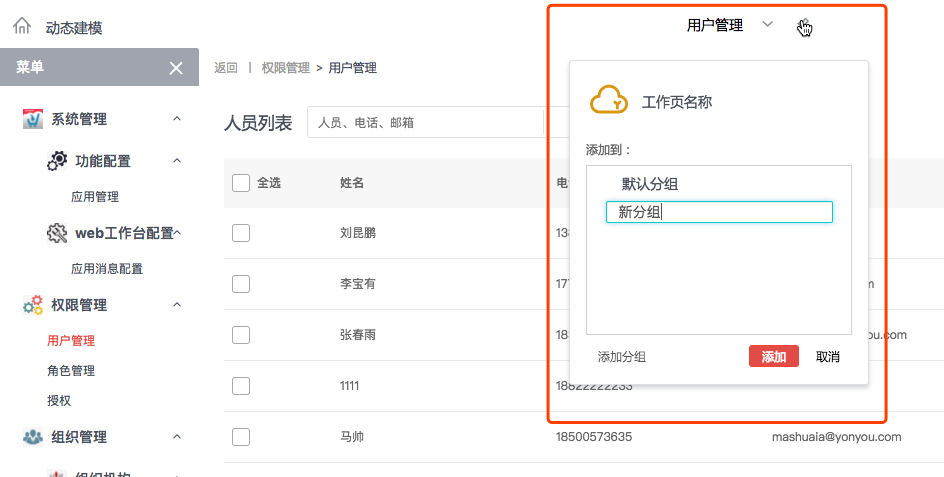

工作台会给每个服务添加默认的磁贴模板，默认模板提供统一的大小、布局和默认行为（点击跳转到磁贴对应的服务）

如果默认模板不能满足需求，也可自己开发一个磁贴模板，完全接管磁贴（如果自定义了磁贴模板，那么连默认的点击跳转行为也需要自己实现）

实现过程中需要注意以下内容：

### 目录规范

- 磁贴模板的开发代码必须放在一个文件夹里

  

- 文件夹中必须有一个main.js，这个文件是整个工程的入口文件

  

### 开发规范

- ####js

  - 开发中引用模块必须使用`import`命令

    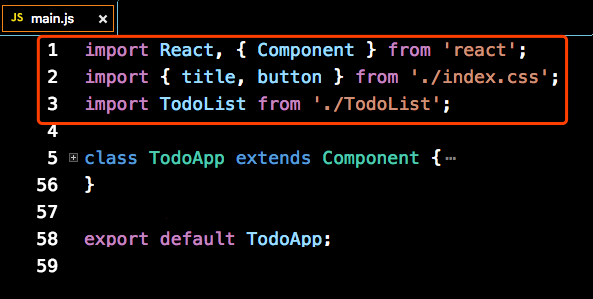

  - main.js的结尾，必须使用`export default`命令指定一个React组件类或者一个纯函数组件

    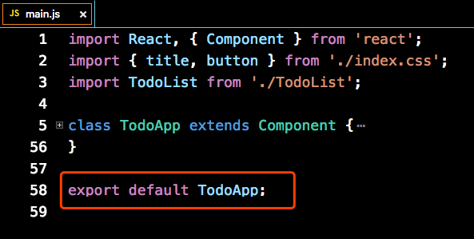

  - 定义React组件类时，需要使用`class`关键字定义

    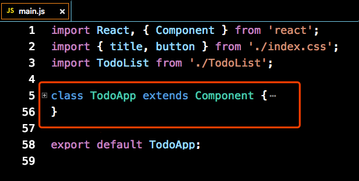

- #### css

  - 目前只支持css和less两种格式的文件

  - 为了保证各个磁贴之间的css互不影响，所有css都会使用 Css Moudles 添加作用域，所以在其他模块中引用时，class名需要按照变量的方式引入，具体规范可参考 [这里](http://www.ruanyifeng.com/blog/2016/06/css_modules.html) 

    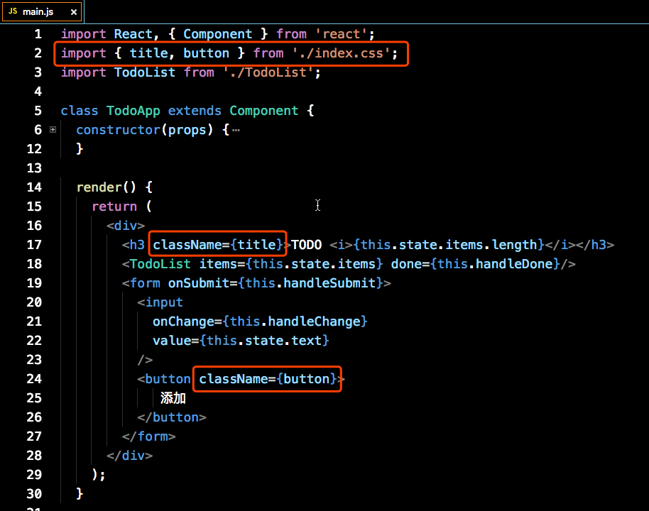

- ####集成

  开发中可以引用widgetInstance、widgetTool、widgetContext模块来完成与工作台的集成和交互

  - #####widgetInstance

    该模块为当前磁贴数据的副本，包含以下几个属性：

    - widgetId

      当前磁贴的id

    - widgetName

      当前磁贴的名字

    - serviceCode

      磁贴对应的服务编码，可用于打开对应服务

    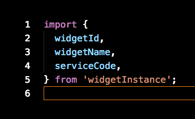

  - #####widgetTool

    该模块用于与工作台通信，目前提供以下两个方法：

    - dispath({String} action, {Object} {…params})

      用于发送消息给工作台，执行指定动作，目前已有的动作有：

      - openService

        - 作用: 

          打开指定的服务

        - 参数:

          - {String} serviceCode

            要打开的服务的编码

          - {Object} data

            要传递给服务的数据，会作为请求参数添加到开启服务的链接中，所有参数都会经过转码，形式如下：

            ?key1=encodeURIComponent(value1)&key2=encodeURIComponent(value2)……

        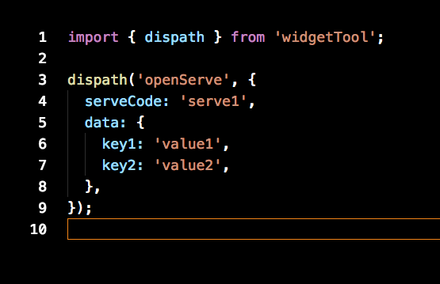

      - openDialog

        - 作用: 

          在全局范围打开一个弹窗，目前只支持文本内容

        - 参数:

          - {String} title

            弹窗的标题

          - {String} content

            弹窗的内容

          - {Function} onClose

            弹窗关闭时的回调，返回false可阻止弹窗关闭

          - {Array\<Object\>} btns

            按钮列表

            - {String} label

              按钮上的文字

            - {Function} fun

              按钮点击的回调，默认值为实例的close方法，如果设置了fun，则close方法会作为参数传入fun中

            - {String} type

              按钮的样式，目前有default(白)，warning(黄)，brand(红)三种取值，默认为default

        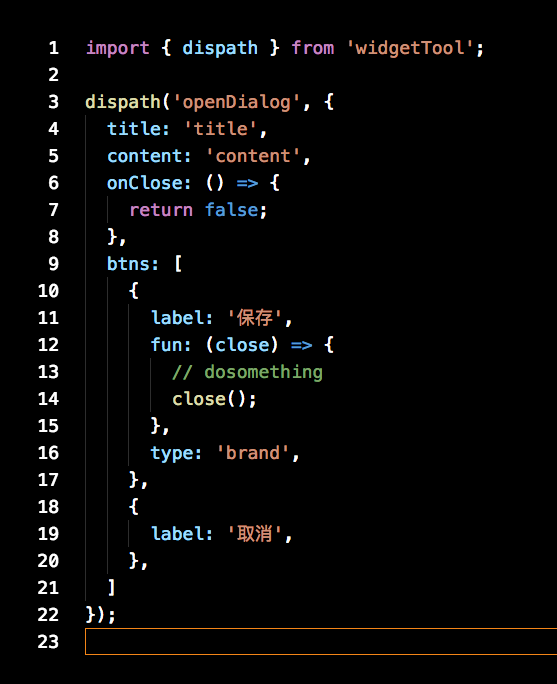

      后续会根据业务需要补充其他动作

    - on({String} eventName, {Function} callback)

      - 作用: 

        用于监听工作台的发出的事件，做出响应动作。

      - 参数:

        - {String} eventName

          事件名，目前的设计中，监听的事件是自定义的，对事件命名没有限制。由于工作台会给每个组件添加作用域，所以不用担心与其他组件冲突。

        - {Function} callback

          事件回调，工作台对当前磁贴发出指定事件时执行，回调函数接收一个事件对象作为参数

      - 返回值:

        - {Function} remove

          执行后取消当前事件的监听

      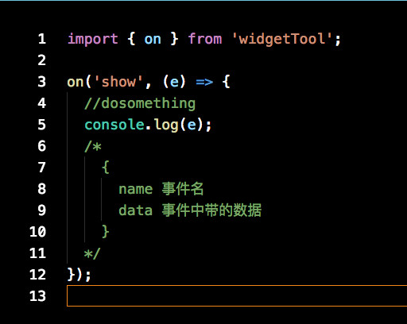

  - ##### widgetContext

    当前环境的上下文数据，包含以下几个属性：

    - tenantid

      租户Id

    - userid

      用户Id

    - username

      用户名

    - theme

      当前主题

    - locale

      当前语言

    - timezone

      当前时区

    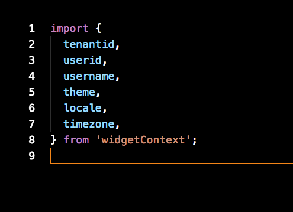

- #### 注册

  磁贴模板开发完成后，需要将代码打包成一个zip，在运维平台上传，才能完成注册。注册时除了指定磁贴模板，还能指定磁贴的大小，背景图片等属性。目前支持的磁贴打下有以下三种：

  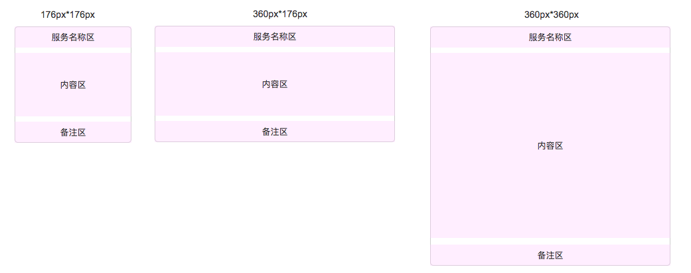

- ####其他建议

  规范对实现磁贴的具体实现没有特别要求，但是在这里不建议直接使用dom操作来控制磁贴的内容，建议利用react的功能，使用数据控制界面变化。后续的迭代中可能在运维平台上添加校验，禁止直接的dom操作。

### 例子

有三个例子，放在了用友云盘上，http://pan.yonyou.com/web/share.html?hash=CtpY3io0QEI

- simple

  最简单的磁贴

- todolist

  引用其他组件的例子

- withDom

  使用dom操作的磁贴

服务集成
---

### SDK

为了让服务能够与与工作台通信，服务需要在自己的页面中引入工作台的JS-SDK。sdk会提供jDiwork模块，需使用 AMD/CMD 标准模块加载方法加载。所有接口通过jDiwork模块来调用。

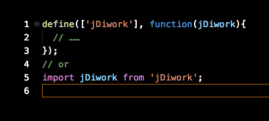

###接口文档

- openService(serviceCode, data, [callback])

  - 作用: 

    打开指定的服务

  - 参数:

    - {String} serviceCode

      要打开的服务的编码

    - {Object} data

      要传递给服务的数据，会作为请求参数添加到开启服务的链接中

    - {Function} [callback]

      接口调用成功后的回调，回调函数接收一个参数作为执行结果

  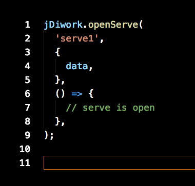

- openDialog(options, [callback])

  - 作用: 

    在全局范围打开一个弹窗，目前只支持文本内容

  - 参数:

    - {Object} options

      弹窗的选项

      - {String} title

        弹窗的标题

      - {String} content

        弹窗的内容

      - {Function} onClose

        弹窗关闭时的回调，返回false可阻止弹窗关闭

      - {Array\<Object\>} btns

        按钮列表

        - {String} label

          按钮上的文字

        - {Function} fun

          按钮点击的回调，默认值为实例的close方法，如果设置了fun，则close方法会作为参数传入fun中

        - {String} type

          按钮的样式，目前有default(白)，warning(黄)，brand(红)三种取值，默认为default

    - {Function} callback

      接口调用成功后的回调，回调函数接收一个参数作为执行结果

  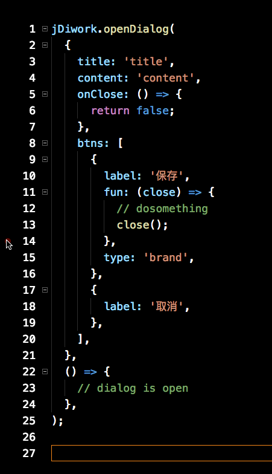

- addBrm(text, [callback])

  - 作用：

    给工作台的面包屑添加数据

  - 参数:

    - {String} text

      面包屑的文字

    - {Function} callback

      接口调用成功后的回调，回调函数接收一个参数作为执行结果

  

- checkServiceOpen(serviceCode, callback)

  - 作用：

    检查当前工作页中指定的服务已经打开，有时我们需要向当前工作页中的其他服务发送消息，而只有已打开的服务才能接收到数据，所以需要在发送前需要先用这个方法检查服务是否打开

  - 参数:

    - {String} serviceCode

      要查询的服务的编码

    - {Function} callback

      接口调用成功后的回调，回调函数接收一个参数作为执行结果，服务已打开为true，未打开为false

  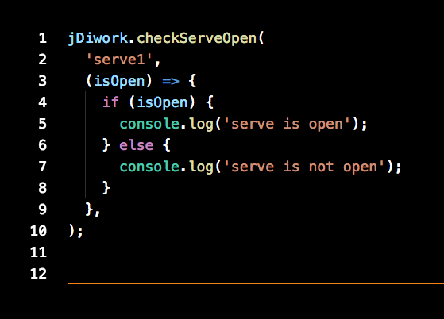

- postDataToService(serviceCode, data, [callback])

  - 作用：

    向指定的服务发送数据，需要在指定服务内执行data方法监听数据传输才能体现出作用，适用于既想更新服务，又不想刷新页面的场景

  - 参数:

    - {String} serviceCode

      要发送数据的服务的编码

    - {Object} data

      要发送的数据，只能是

    - {Function} callback

      接口调用成功后的回调，回调函数接收一个参数作为执行结果

  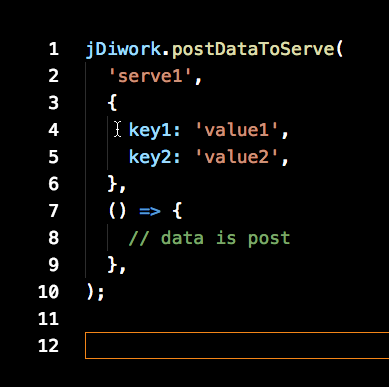

- onData(callback)

  - 作用：

    监听当前服务接收数据的情况，每次接收到新数据都会触发回调函数

  - 参数:

    - {Function} callback

      当服务接收到数据时会触发回调，数据会作为参数传入回调函数

  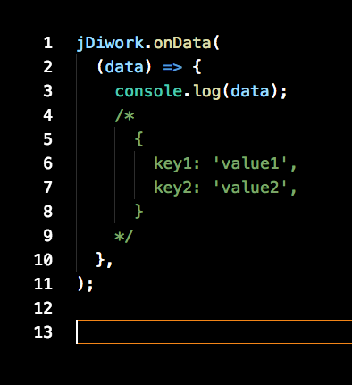

- getContext(callback)

  - 作用：

    获取当前工作台环境的上下文

  - 参数:

    - {Function} callback

      上下文对象会作为参数传入回调函数，上下文数据，包含以下几个属性：

      - tenantid

        租户Id

      - userid

        用户Id

      - username

        用户名

      - theme

        当前主题

      - locale

        当前语言

      - timezone

        当前时区

  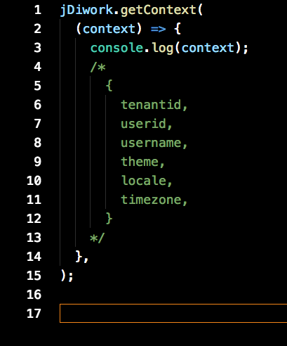

- ready(callback)

  - 作用：

    当sdk初始化完成时，会执行回callback。其他接口需要在callback中调用才能才能正常运行。

  - 参数:

    - {Function} callback

      sdk初始化完成时调用回调函数

  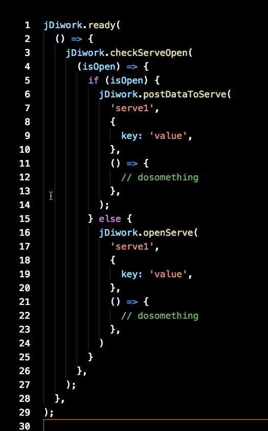

组件集成
---

在工作台的开发过程中，有可能会使用其他团队提供的业务or功能组件。集成的组件需要遵守以下规则：

- 组件的对外接口为一个启动函数。

  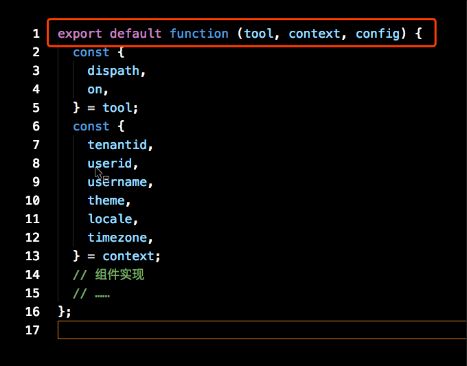

- 启动函数接收三个参数tool，context，config。其中tool和context的功能与内容与磁贴集成规范中，widgetTool、widgetContext一致。config为组件所需的数据，具体内容由组件与工作台约定。

  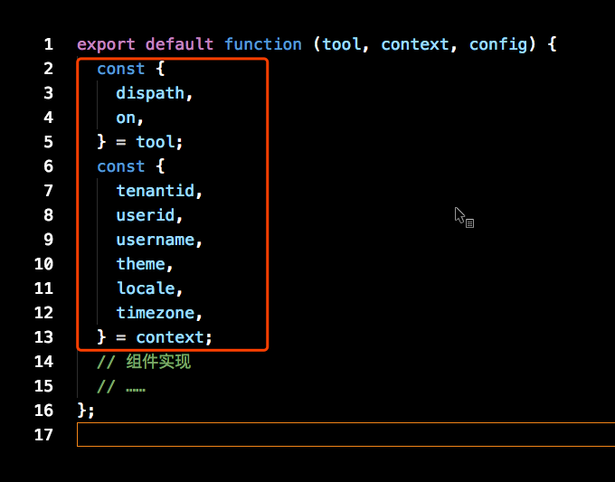

- 工作台与组件通过tool的dispatch和on方法通信。

- 组件需要出一份文档，描述config的内容和提供了哪些事件给工作台调用。
